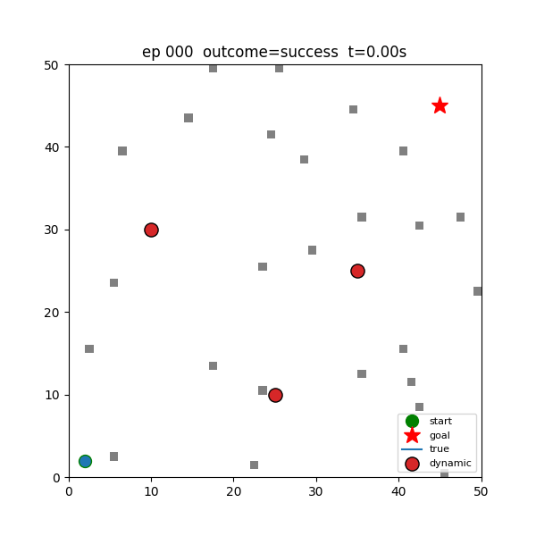
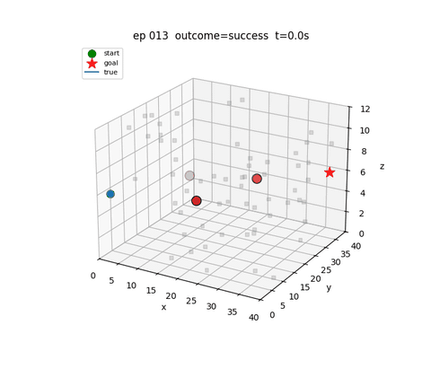
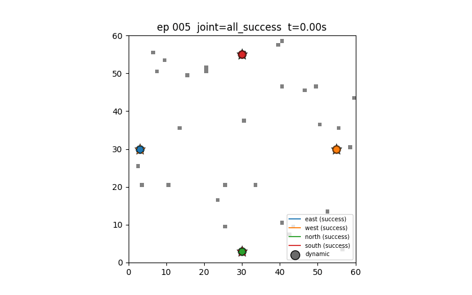
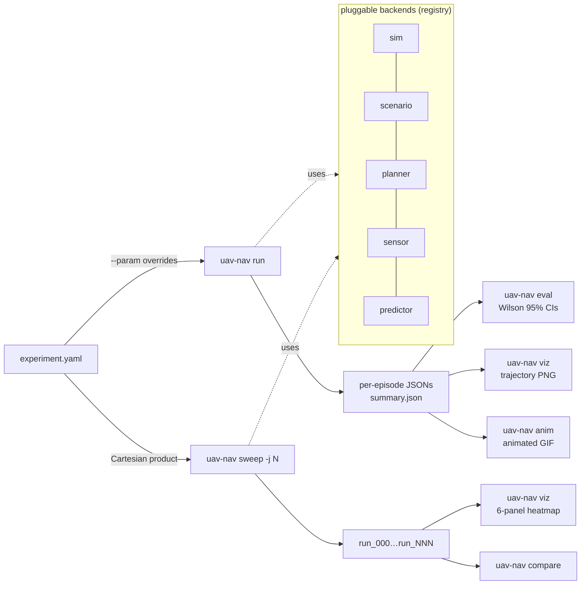
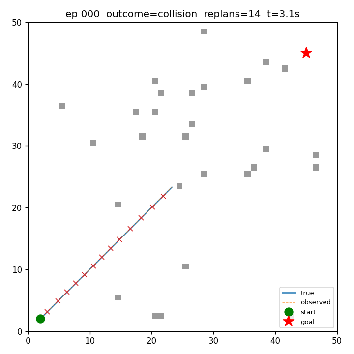
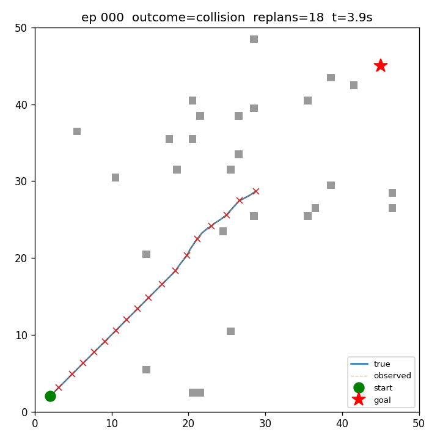
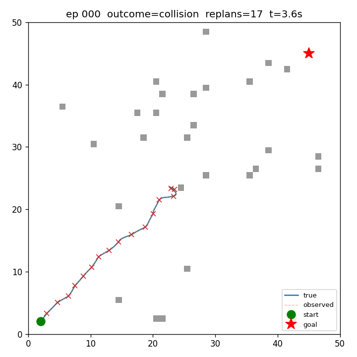
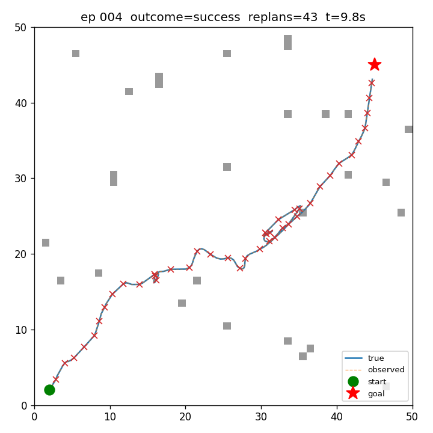
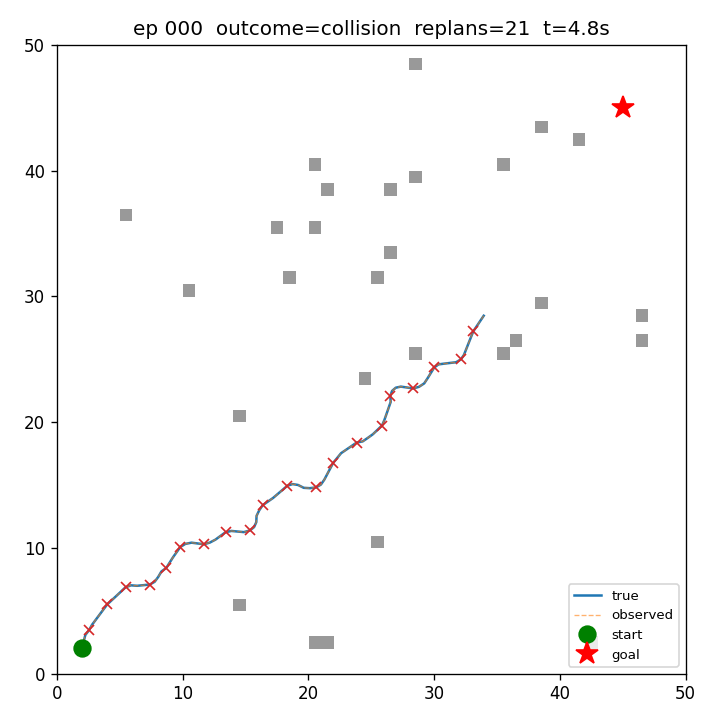
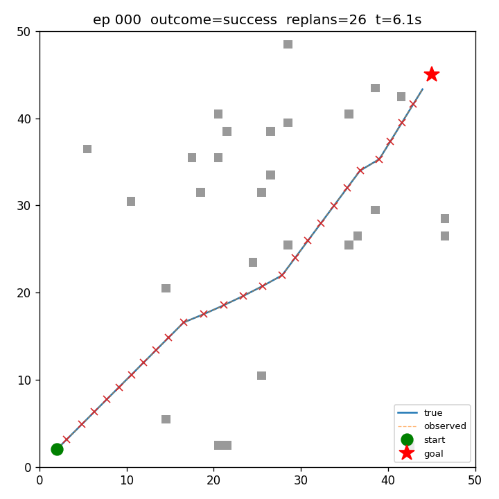

<div align="center">

# uav-nav-lab

**An OSS Python research framework for high-speed UAV navigation —
controlled ablations in minutes, statistical CIs on every metric, and
every example YAML carries its own validated finding.**

[](https://github.com/rsasaki0109/uav-nav-lab/actions/workflows/ci.yml)
[](https://github.com/rsasaki0109/uav-nav-lab/actions/workflows/ci.yml)
[](https://github.com/rsasaki0109/uav-nav-lab/releases)
[](LICENSE)
[](https://github.com/rsasaki0109/uav-nav-lab/stargazers)

<table>
<tr>
<td></td>
<td></td>
<td></td>
</tr>
<tr>
<td align="center"><i>2D — Pareto-MPC (n=16, h=20) through three bouncing obstacles.</i></td>
<td align="center"><i>3D — same planner family on a 40×40×12 voxel world.</i></td>
<td align="center"><i>Multi-drone — 4 drones cross-crossing via CV peer prediction.</i></td>
</tr>
</table>

</div>

> **TL;DR.** On a 50 × 50 dynamic-obstacle scenario (n=30 episodes,
> Wilson 95 % CIs), this framework produces — from six one-line
> `uav-nav run` invocations — straight-line **0 %**, A* **20 %**,
> RRT* **23 %** (CPU-saturated), CHOMP **53 %** (cheapest at 21 ms),
> RRT **73 %**, Pareto-MPC **100 %**. Each example YAML carries the
> table, the heatmap, and the reproduce command in its header.

---

## ✨ What you get

- **Pluggable backends** for sim / scenario / planner / sensor / predictor —
  add one with a `@REGISTRY.register("name")` decorator and a
  `from_config(cfg)` classmethod.
- **YAML experiments** + Cartesian-product sweeps:
  `uav-nav sweep cfg.yaml --param k=a,b,c --param k2=start:stop:step`.
- **Statistical rigor by default**: Wilson 95% intervals on rates,
  mean ± 1.96·SEM on continuous metrics, per-call planner compute
  budget (mean / p95 / max ms).
- **Multi-drone** scenarios with joint-success aggregation and palette viz.
- **6-panel sweep heatmap** for compute-aware ablations, animated GIF replays.

## 🤔 Why

Most UAV planning research either (a) hard-codes a single MPC variant,
single sensor, single scenario, and reports a number, or (b) buries
ablations under stacks of glue code. Neither makes it easy to ask *"does
this idea actually beat what I already have, with the CI to back it?"*

`uav-nav-lab` is the framework I wanted *while* doing the research:
declare the experiment in YAML, sweep with `--param`, get heatmaps and
Wilson 95 % CIs out of the box, and have every config carry its own
validated finding — so the file is the artifact, not a Notion page.

## 🚀 Quick start

```bash
git clone https://github.com/rsasaki0109/uav-nav-lab
cd uav-nav-lab
pip install -e '.[dev,viz]'        # numpy + pyyaml + matplotlib + pytest
pytest -q                          # full suite runs in seconds

uav-nav run     examples/exp_basic.yaml
uav-nav eval    results/basic_astar
uav-nav viz     results/basic_astar
```

A 2D heatmap sweep is one CLI invocation:

```bash
uav-nav sweep examples/exp_predictive.yaml \
  --param planner.horizon=20 --param planner.n_samples=16 \
  --param planner.max_speed=10,15,20,25,30 \
  --param planner.replan_period=0.1,0.2,0.5,1.0,2.0 \
  --param num_episodes=20 -j 4
uav-nav viz <out>     # → 6-panel sweep_summary.png
```

## 🛠️ CLI

| command | what |
|---|---|
| `uav-nav run <yaml>` | run all episodes, write per-episode JSONs + `summary.json` |
| `uav-nav eval <run_dir>` | recompute metrics from logs, print Wilson 95 % rates + planner-dt budget |
| `uav-nav compare <a> <b> ...` | side-by-side table with ± half-widths |
| `uav-nav sweep <yaml> --param k=spec` | Cartesian-product over `--param`s; each cell gets its own dir |
| `uav-nav viz <run_or_sweep>` | trajectory PNG per episode, or 1D / 2D sweep heatmap |
| `uav-nav anim <run_dir>` | animated GIF replay (2D) |
| `uav-nav video <run_dir>` | ffmpeg per-step AirSim camera frames into per-episode MP4 |
| `uav-nav list` | enumerate registered planners / sensors / sims / scenarios |

`--param` syntax: `start:stop:step` for ranges, `a,b,c` for explicit lists,
`[3,0]` for vector values, `true` / `false` literals. Three-level dotted
keys work: `planner.predictor.velocity_noise_std=0.0,0.5,1.0`.

## 🏗️ Architecture

The CLI is one verb per pipeline stage; each verb composes the same
pluggable backends:



Source layout:

```
uav_nav_lab/
├── sim/         dummy_2d / dummy_3d (point-mass), airsim, ros2
├── scenario/    grid_world, voxel_world, multi_drone_grid
├── planner/     astar, straight, mpc, rrt, rrt_star, chomp, mpc_chomp  (registry: PLANNER_REGISTRY)
├── sensor/      perfect, delayed, kalman_delayed, lidar, pointcloud_occupancy, depth_image_occupancy
├── predictor/   constant_velocity, noisy_velocity, kalman_velocity
├── runner/      experiment, multi (multi-drone), sweep
├── eval/        metrics (Wilson + SEM CIs), compare
├── viz / anim / sweep_viz   2D + 3D + GIF + 6-panel heatmap
└── cli          run / eval / compare / sweep / viz / anim / list
```

Backends at a glance:

| kind | shipped | registry |
|---|---|---|
| sim | `dummy_2d`, `dummy_3d`, `airsim`, `ros2` | `SIM_REGISTRY` |
| scenario | `grid_world`, `voxel_world`, `multi_drone_grid` | `SCENARIO_REGISTRY` |
| planner | `astar`, `straight`, `mpc`, `rrt`, `rrt_star`, `chomp`, `mpc_chomp` | `PLANNER_REGISTRY` |
| sensor | `perfect`, `delayed`, `kalman_delayed`, `lidar`, `pointcloud_occupancy`, `depth_image_occupancy` | `SENSOR_REGISTRY` |
| predictor | `constant_velocity`, `noisy_velocity`, `kalman_velocity` | `PREDICTOR_REGISTRY` |

Adding a new backend is one new file with a `@REGISTRY.register("name")`
decorator and a `from_config(cfg)` classmethod — the CLI picks it up via
`type: name` in YAML, no central wiring needed.

## 📊 Selected research findings

Each finding lives in the comment header of the YAML that produces it,
along with a one-line `uav-nav sweep` invocation that reproduces it.
Wilson 95 % intervals on rates, mean ± 1.96·SEM on continuous metrics.

### 🏁 Planner head-to-head on dynamic obstacles

Same 50 × 50 world, same three bouncing obstacles, same perfect sensor —
only the planner changes. n=30 episodes per configuration:

<table>
<tr>
<td align="center"><b>straight</b><br>0.0 %</td>
<td align="center"><b>astar</b><br>20.0 %</td>
<td align="center"><b>rrt*</b><br>23.3 %</td>
<td align="center"><b>chomp</b><br>53.3 %</td>
<td align="center"><b>rrt</b><br>73.3 %</td>
<td align="center"><b>mpc (Pareto)</b><br>100.0 %</td>
</tr>
<tr>
<td></td>
<td></td>
<td></td>
<td></td>
<td></td>
<td></td>
</tr>
<tr>
<td align="center">plan_dt<br>0.04 / 0.05 ms</td>
<td align="center">plan_dt<br>4.75 / 8.97 ms</td>
<td align="center">plan_dt<br>464 / 521 ms ⚠️</td>
<td align="center">plan_dt<br>21.31 / 22.31 ms</td>
<td align="center">plan_dt<br>29.99 / 64.27 ms</td>
<td align="center">plan_dt<br>52.16 / 56.96 ms</td>
</tr>
</table>

A* sees only a snapshot at replan time and walks into where the bouncing
obstacles will be 0.2 s later — 20 %. **RRT (continuous-space sampling)
beats grid A* by +53 pp at similar compute** — the path is not constrained
to the 8-connected lattice, so straight-line edges across open space
move the drone past obstacles before they cross. MPC at the Pareto
config (`n_samples=16, horizon=20`) is the only planner with explicit
motion prediction and clears every episode.

**CHOMP slots in the middle (53.3 %) and is the cheapest non-trivial
planner of the lot — 21.3 ms ± 0.12, p95 22.3 ms — beating both RRT and
MPC on per-replan compute**. The smoothness term keeps trajectories
short and tight (47.6 ± 8.2 m vs RRT's typical zigzag) but local
optimisation cannot tunnel through obstacles the straight-line init
crosses, capping success below RRT's continuous-space sampling. Pair
it with an RRT-init mode and the picture might invert — see the
roadmap for that follow-up.

**Counter-intuitively, RRT\* loses to plain RRT here.** Asymptotic
optimality costs ~15× the per-replan compute (464 ms mean vs 30 ms),
which is 2.3× the 200 ms replan period — every replan arrives late, so
the drone follows stale plans into moving obstacles. Optimality cannot
beat freshness in a dynamic scenario unless the optimization fits the
replan budget. Same Pareto-saturation trap the 2D MPC re-validation
saga uncovered, just on the search side.

> Reproduce: `uav-nav run examples/exp_compare_{straight,astar,rrt,rrt_star,chomp,mpc}.yaml`,
> then `uav-nav compare results/cmp_straight results/cmp_astar results/cmp_rrt_star results/cmp_chomp results/cmp_rrt results/cmp_mpc`.

### More studies — see [docs/findings.md](docs/findings.md)

The full long-form write-ups (tables, ablation reasoning, methodological
takeaways) live in [`docs/findings.md`](docs/findings.md):

- **MPC compute Pareto** — n_samples × horizon; sole optimal cell n=16/h=20.
- **3D Pareto** — n_samples preference flips vs 2D; the 3D plan_dt blow-up
  was a missing static-cost-to-go cache, not a CPU cliff.
- **3D perception-latency cliff** — same corner as 2D, softened by escape
  volume; velocity_window optimum *inverts* (3D peaks at window=1, not 5).
- **Pareto config rewrites prior conclusions** — methodological lesson on
  always re-validating ablations at the planner's Pareto-optimal cell.
- **Multi-drone N-scaling** — peer-prediction *correlates* failures the
  right way (joint succ at N=4 beats independence model by +14.7 pp).
- **Wind miscalibration** — diagonal-wins; +73 pp swing from awareness at
  one cell, but no belief beats `sim_wind > max_speed` physics.
- **Perception-latency cliff: a four-step research saga** — including
  honest negative result on Kalman ego (moving-average wins).

## ✅ Status

- **v0.1.0** released; GitHub Actions CI on Python 3.10 / 3.11 / 3.12
  + a CLI smoke job.
- **6 sensor backends** (`perfect`, `delayed`, `kalman_delayed`, `lidar`, `pointcloud_occupancy`, `depth_image_occupancy`),
  **3 predictor backends** (`constant_velocity`, `noisy_velocity`,
  `kalman_velocity`), **6 planners** (`astar`, `straight`, `mpc`, `rrt`,
  `rrt_star`, `chomp`), **3 scenarios** (`grid_world`, `voxel_world`,
  `multi_drone_grid`).
- All ablation results are reproducible from the example YAMLs by
  copy-pasting one `uav-nav sweep ...` line.

External backends:

- **AirSim** (`uav_nav_lab/sim/airsim_bridge.py`) is wired end-to-end —
  ENU ↔ NED conversion, `simPause` + `simContinueForTime` for
  deterministic fast-forward, async-command join, ENU→NED velocity
  setpoints and NED→ENU kinematics readback. Run via
  `examples/exp_airsim.yaml` after `pip install airsim` and starting
  any AirSim binary; mock-injectable client makes the conversion logic
  CI-testable without an AirSim install. Optional `lidars: [name, …]`
  in the simulator config polls `getLidarData(name)` per step and
  exposes the (N, 3) ENU point cloud at
  `state.extra["lidar_points"][name]`. Pair with the
  `pointcloud_occupancy` sensor (`type: pointcloud_occupancy` in the
  sensor block) to rasterize those returns into the planner's
  occupancy grid; the bridge itself stays perception-agnostic.
  Optional `cameras: [{name, image_type}, …]` polls `simGetImages()`
  and stashes compressed PNG bytes at `state.extra["camera_images"][name]`;
  set `output.save_camera_frames: true` and run `uav-nav video <run_dir>`
  to ffmpeg them into per-episode / per-camera MP4 demo reels. Optional
  `depths: [{name, fov_deg, width, height}, …]` polls the same call
  with `pixels_as_float=True` and surfaces a `{depth, intrinsics}`
  payload at `state.extra["depth_images"][name]` — pair with
  `depth_image_occupancy` to project pixels into the planner's
  occupancy grid (the depth-camera analogue of the
  `pointcloud_occupancy` LiDAR path).
- **ROS 2** (`uav_nav_lab/sim/ros2_bridge.py`) is wired end-to-end —
  publishes `geometry_msgs/Twist` on `/cmd_vel`, subscribes to
  `nav_msgs/Odometry` on `/odom` (and optional `std_msgs/Bool` on
  `/collision`), spins once per `dt` so the latest message is
  consumed each step. Run via `examples/exp_ros2.yaml` after sourcing
  ROS 2 and bringing up a sim (Gazebo / Ignition / PX4-SITL via
  MAVROS). Frames assumed ENU per REP-103; PX4-NED users convert one
  layer up. Mock-injectable adapter makes the plumbing CI-testable
  without rclpy. Optional `lidars: [topic, …]` subscribes to
  `sensor_msgs/PointCloud2` and decodes each step's latest cloud to
  (N, 3) ENU points at `state.extra["lidar_points"][topic]` — same key
  as the AirSim bridge, so `pointcloud_occupancy` consumes both
  backends without a code change. Optional `cameras: [topic, …]`
  subscribes to `sensor_msgs/Image` and PNG-encodes each frame to
  `state.extra["camera_images"][topic]`, feeding the same
  `output.save_camera_frames` + `uav-nav video` pipeline. Set
  `use_sim_time: true` (with optional `clock_topic` / `sim_time_wall_timeout`)
  to anchor `state.t` on `/clock` instead of wall-clock — PX4-SITL
  fast-forward and Gazebo `--lockstep` then speed up the experiment by
  the same factor as the sim, with the wall-clock timeout protecting
  the runner from a paused or crashed sim.

## 🗺️ Roadmap

- 3D perception-latency re-validation in `voxel_world` (Pareto already
  validated — see [docs/findings.md](docs/findings.md)).
- 3D AirSim demo run + GIF in the README hero (the bridge is wired but
  the README still shows the dummy-3D animation).

## 📄 License

Apache-2.0.
