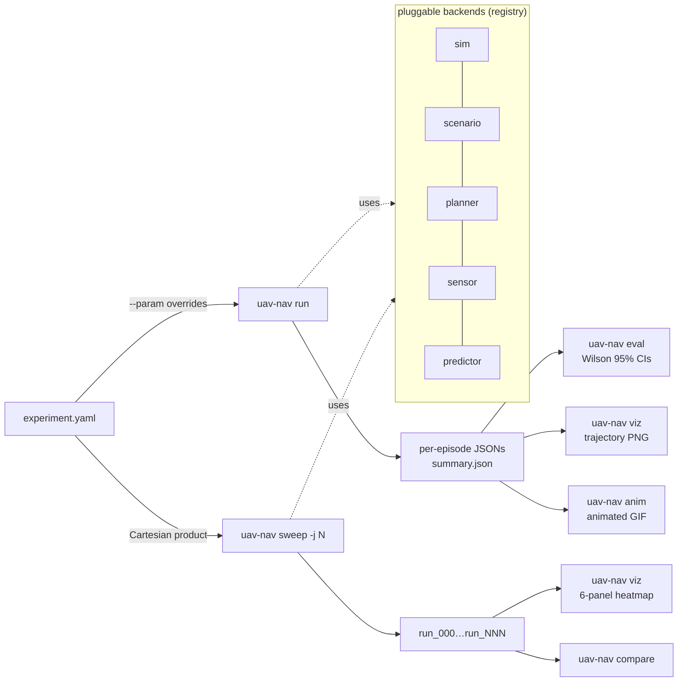

<div align="center">

# uav-nav-lab

**An OSS Python research framework for high-speed UAV navigation —
controlled ablations in minutes, statistical CIs on every metric, and
every example YAML carries its own validated finding.**

[](https://github.com/rsasaki0109/uav-nav-lab/actions/workflows/ci.yml)
[](https://github.com/rsasaki0109/uav-nav-lab/actions/workflows/ci.yml)
[](https://github.com/rsasaki0109/uav-nav-lab/releases)
[](LICENSE)
[](https://github.com/rsasaki0109/uav-nav-lab/stargazers)


*Pareto-MPC (n_samples=16, horizon=20) routing through three bouncing
dynamic obstacles to a goal — same scenario used for every result below.*

</div>

> **TL;DR.** On a 50 × 50 dynamic-obstacle scenario (n=30 episodes,
> Wilson 95 % CIs), this framework produces — from five one-line
> `uav-nav run` invocations — straight-line **0 %**, A* **20 %**,
> RRT* **23 %** (CPU-saturated), RRT **73 %**, Pareto-MPC **100 %**.
> Each example YAML carries the table, the heatmap, and the reproduce
> command in its header.

---

## ✨ What you get

- **Pluggable backends** for sim / scenario / planner / sensor / predictor —
  add one with a `@REGISTRY.register("name")` decorator and a
  `from_config(cfg)` classmethod.
- **YAML experiments** + Cartesian-product sweeps:
  `uav-nav sweep cfg.yaml --param k=a,b,c --param k2=start:stop:step`.
- **Statistical rigor by default**: Wilson 95% intervals on rates,
  mean ± 1.96·SEM on continuous metrics, per-call planner compute
  budget (mean / p95 / max ms).
- **Multi-drone** scenarios with joint-success aggregation and palette viz.
- **6-panel sweep heatmap** for compute-aware ablations, animated GIF replays.

## 🤔 Why

Most UAV planning research either (a) hard-codes a single MPC variant,
single sensor, single scenario, and reports a number, or (b) buries
ablations under stacks of glue code. Neither makes it easy to ask *"does
this idea actually beat what I already have, with the CI to back it?"*

`uav-nav-lab` is the framework I wanted *while* doing the research:
declare the experiment in YAML, sweep with `--param`, get heatmaps and
Wilson 95 % CIs out of the box, and have every config carry its own
validated finding — so the file is the artifact, not a Notion page.

## 🚀 Quick start

```bash
git clone https://github.com/rsasaki0109/uav-nav-lab
cd uav-nav-lab
pip install -e '.[dev,viz]'        # numpy + pyyaml + matplotlib + pytest
pytest -q                          # 42 tests, runs in seconds

uav-nav run     examples/exp_basic.yaml
uav-nav eval    results/basic_astar
uav-nav viz     results/basic_astar
```

A 2D heatmap sweep is one CLI invocation:

```bash
uav-nav sweep examples/exp_predictive.yaml \
  --param planner.horizon=20 --param planner.n_samples=16 \
  --param planner.max_speed=10,15,20,25,30 \
  --param planner.replan_period=0.1,0.2,0.5,1.0,2.0 \
  --param num_episodes=20 -j 4
uav-nav viz <out>     # → 6-panel sweep_summary.png
```

## 🛠️ CLI

| command | what |
|---|---|
| `uav-nav run <yaml>` | run all episodes, write per-episode JSONs + `summary.json` |
| `uav-nav eval <run_dir>` | recompute metrics from logs, print Wilson 95 % rates + planner-dt budget |
| `uav-nav compare <a> <b> ...` | side-by-side table with ± half-widths |
| `uav-nav sweep <yaml> --param k=spec` | Cartesian-product over `--param`s; each cell gets its own dir |
| `uav-nav viz <run_or_sweep>` | trajectory PNG per episode, or 1D / 2D sweep heatmap |
| `uav-nav anim <run_dir>` | animated GIF replay (2D) |
| `uav-nav list` | enumerate registered planners / sensors / sims / scenarios |

`--param` syntax: `start:stop:step` for ranges, `a,b,c` for explicit lists,
`[3,0]` for vector values, `true` / `false` literals. Three-level dotted
keys work: `planner.predictor.velocity_noise_std=0.0,0.5,1.0`.

## 🏗️ Architecture

The CLI is one verb per pipeline stage; each verb composes the same
pluggable backends:



Source layout:

```
uav_nav_lab/
├── sim/         dummy_2d / dummy_3d (point-mass), airsim, ros2 (stubs)
├── scenario/    grid_world, voxel_world, multi_drone_grid
├── planner/     astar, straight, mpc, rrt, rrt_star  (registry: PLANNER_REGISTRY)
├── sensor/      perfect, delayed, kalman_delayed, lidar
├── predictor/   constant_velocity, noisy_velocity, kalman_velocity
├── runner/      experiment, multi (multi-drone), sweep
├── eval/        metrics (Wilson + SEM CIs), compare
├── viz / anim / sweep_viz   2D + 3D + GIF + 6-panel heatmap
└── cli          run / eval / compare / sweep / viz / anim / list
```

Backends at a glance:

| kind | shipped | registry |
|---|---|---|
| sim | `dummy_2d`, `dummy_3d` (+ `airsim`, `ros2` stubs) | `SIM_REGISTRY` |
| scenario | `grid_world`, `voxel_world`, `multi_drone_grid` | `SCENARIO_REGISTRY` |
| planner | `astar`, `straight`, `mpc`, `rrt`, `rrt_star` | `PLANNER_REGISTRY` |
| sensor | `perfect`, `delayed`, `kalman_delayed`, `lidar` | `SENSOR_REGISTRY` |
| predictor | `constant_velocity`, `noisy_velocity`, `kalman_velocity` | `PREDICTOR_REGISTRY` |

Adding a new backend is one new file with a `@REGISTRY.register("name")`
decorator and a `from_config(cfg)` classmethod — the CLI picks it up via
`type: name` in YAML, no central wiring needed.

## 📊 Selected research findings

Each finding lives in the comment header of the YAML that produces it,
along with a one-line `uav-nav sweep` invocation that reproduces it.
Wilson 95 % intervals on rates, mean ± 1.96·SEM on continuous metrics.

### 🏁 Planner head-to-head on dynamic obstacles

Same 50 × 50 world, same three bouncing obstacles, same perfect sensor —
only the planner changes. n=30 episodes per configuration:

<table>
<tr>
<td align="center"><b>straight</b><br>0.0 %</td>
<td align="center"><b>astar</b><br>20.0 %</td>
<td align="center"><b>rrt*</b><br>23.3 %</td>
<td align="center"><b>rrt</b><br>73.3 %</td>
<td align="center"><b>mpc (Pareto)</b><br>100.0 %</td>
</tr>
<tr>
<td></td>
<td></td>
<td></td>
<td></td>
<td></td>
</tr>
<tr>
<td align="center">plan_dt<br>0.04 / 0.05 ms</td>
<td align="center">plan_dt<br>4.75 / 8.97 ms</td>
<td align="center">plan_dt<br>464 / 521 ms ⚠️</td>
<td align="center">plan_dt<br>29.99 / 64.27 ms</td>
<td align="center">plan_dt<br>52.16 / 56.96 ms</td>
</tr>
</table>

A* sees only a snapshot at replan time and walks into where the bouncing
obstacles will be 0.2 s later — 20 %. **RRT (continuous-space sampling)
beats grid A* by +53 pp at similar compute** — the path is not constrained
to the 8-connected lattice, so straight-line edges across open space
move the drone past obstacles before they cross. MPC at the Pareto
config (`n_samples=16, horizon=20`) is the only planner with explicit
motion prediction and clears every episode.

**Counter-intuitively, RRT\* loses to plain RRT here.** Asymptotic
optimality costs ~15× the per-replan compute (464 ms mean vs 30 ms),
which is 2.3× the 200 ms replan period — every replan arrives late, so
the drone follows stale plans into moving obstacles. Optimality cannot
beat freshness in a dynamic scenario unless the optimization fits the
replan budget. Same Pareto-saturation trap the 2D MPC re-validation
saga uncovered, just on the search side.

> Reproduce: `uav-nav run examples/exp_compare_{straight,astar,rrt,rrt_star,mpc}.yaml`,
> then `uav-nav compare results/cmp_straight results/cmp_astar results/cmp_rrt results/cmp_rrt_star results/cmp_mpc`.

### MPC compute Pareto

`examples/exp_predictive.yaml` — n_samples × horizon. The 6-panel
output of `uav-nav viz <sweep_dir>` lets you read off the success
ceiling and the compute it costs in one figure:

<p align="center">

</p>

At n=20 episodes per cell:

| n_samples \ horizon | 20 | 40 | 60 | 80 | 120 |
|---|---|---|---|---|---|
| 8   | 100 | 90  | 80 | 65 | 45 |
| 16  | **100** | 85  | 80 | 65 | 35 |
| 32  | 100 | 95  | 75 | 60 | 35 |
| 64  | 100 | 100 | 75 | 60 | 45 |
| 128 | 100 | 100 | 95 | 80 | 40 |

Sole Pareto-optimal point: **n_samples=16, horizon=20 → 100 % / 51 ms**.
Longer rollouts actively *hurt* success — the reach-goal bonus fires
less often when the rollout overshoots the goal radius mid-trajectory.

### 3D Pareto: the n_samples preference flips

`examples/exp_3d_predictive.yaml` — the same n_samples × horizon sweep on
a 3D `voxel_world` (40×40×12, three bouncing 3D dynamic obstacles, n=8
post-cache):

<p align="center">

</p>

Findings vs the 2D analogue:

- **The Pareto frontier shifts to lower n_samples.** The 2D-optimal
  config (n=16, h=20 → 100 % / 51 ms in 2D) lands at only 75 % / 91 ms
  in 3D. The strongest 3D cells are **n=8, h=20 → 88 % / 70 ms** and
  n=128, h=40 → 100 % / 273 ms. Fibonacci-sphere sampling already
  covers the 3D escape directions densely enough that fewer per-step
  samples suffice — compute is better spent on horizon depth, opposite
  of 2D's preference.
- **The "longer rollouts hurt" effect partly transfers.** 2D drops
  monotonically with horizon (100 → 35 %); 3D drops more gently (most
  rows stay 75 → 38 %), but the trend is the same. The 3D escape volume
  softens but does not eliminate the reach-goal-bonus overshoot.
- **The 3D plan_dt blow-up was a Dijkstra artifact.** A first pass had
  every cell at 1.3-2.2 s — too slow to fit `replan_period=0.2 s`. The
  static cost-to-go cache (added to `SamplingMPCPlanner`) brought 3D
  plan_dt back to the same order of magnitude as 2D (70-750 ms across
  the grid), making this sweep and the cliff sweeps actually tractable.

Methodological transfer: re-validate Pareto in every dimensionality.
n_samples preference flips, the compute envelope changes, and what
looked like a CPU-saturation cliff in 3D was actually a missing cache.

### 3D perception-latency cliff: same corner, softened

Same 3D scenario, sensor.delay × max_speed sweep at the 3D Pareto config
(n_samples=8, horizon=20, n=6):

<p align="center">

</p>

|  delay \ speed  |  10  |  15  |  20  |  25  |  30  |
|---|---|---|---|---|---|
| 0.00 |  83 | 100 | 100 | 100 |  83 |
| 0.05 |  83 | 100 | 100 | 100 |  83 |
| 0.10 |  83 | 100 | 100 |  83 |  50 |
| 0.20 |  67 | 100 |  83 |  83 |  50 |
| 0.50 |  83 |  83 | **33** |  50 |  50 |

The cliff transfers from 2D to 3D in the same `delay=0.5 × speed≥20 m/s`
corner. 2D had this region at 10-25 %; 3D softens it to 33-50 % —
the extra escape volume helps but does not eliminate the failure mode.

**3D cliff remediation: the velocity_window optimum *inverts* vs 2D.**
At the 3D cliff cell (delay=0.5, speed=20, n=12):

| sensor config | succ % | CI95 |
|---|---|---|
| baseline (no extrap) | 33.3 | [13.8, 60.9] |
| `extrapolate=true, window=1` | **83.3** | [55.2, 95.3] |
| `extrapolate=true, window=3` | 66.7 | [39.1, 86.2] |
| `extrapolate=true, window=5` | 58.3 | [32.0, 80.7] |
| `extrapolate=true, window=10` | 33.3 | [13.8, 60.9] |

CV ego extrapolation is the same big lever in 3D — +50 pp at window=1,
Wilson 95 % CIs do not overlap. But **the optimum inverts**: 2D's
peak was window=5, 3D's peak is window=1. The 3D escape volume lets
the drone trace smoother trajectories, so the 1-sample finite-
difference velocity is already accurate; smoothing only adds lag,
and lag hurts most at high speed where the cliff lives.

Engineering takeaway: the *parameter setting* of a remediation does
not transfer across dimensionalities even when the *technique* does.
Always re-tune ego-extrapolation window per scenario regime.

### Pareto config materially rewrites prior conclusions

The previous heatmap on the same scenario at the YAML's old defaults
(n_samples=32, horizon=60) reported a "dynamic-feasibility cliff at
25 m/s". At the Pareto config that cliff disappears (35 – 65 % success
at speed = 25-30 m/s), and replan_period — which "barely mattered"
before — now drives a 40 – 70 pp swing across 0.1 – 2.0 s. The earlier
conclusion was partly a CPU-saturation artifact: at horizon=60 every
replan took ~200 ms, so even replan_period=0.1 s could not actually
keep up.

> **Methodological lesson** baked into the YAML header: always validate
> ablation conclusions at the planner's Pareto-optimal config —
> suboptimal MPC settings can mask both ceilings (max feasible speed)
> and sensitivities (replan-period effect, delay tolerance).

### Multi-drone N-scaling and peer-prediction coordination

<p align="center">

</p>

*N=3 multi-drone episode — alice / bob / charlie all reach their
opposite-corner goals while routing around each other via the MPC's
constant-velocity peer prediction.*

`examples/exp_multi_drone_{2,3,4}.yaml` — same world, only drone count
changes. n=30, joint metrics with Wilson 95 % CIs:

| N | joint succ | joint coll | per-drone succ |
|---|---|---|---|
| 2 | 96.7 % [83, 99] | 3.3 %  | 98.3 % |
| 3 | 70.0 % [52, 83] | 30.0 % | 87.8 % |
| 4 | 73.3 % [56, 86] | 26.7 % | 87.5 % |

Independence-model expectation `joint = per_drone^N`:
- N=4: actual 73.3 %  >  expected 58.6 %   (Δ = **+14.7 pp**)

The MPC's constant-velocity peer prediction *correlates failures in the
right direction* — when one drone yields, the others see its new
trajectory and react, so the system as a whole degrades less than
independent drones would.

### Wind miscalibration: planner belief must match sim reality

`examples/exp_wind.yaml` — constant northward wind disturbance × planner
wind belief, 4 × 4 grid, n=15 episodes:

<p align="center">

</p>

|  sim_wind \ planner_wind | 0 | 3 | 6 | 9 |
|---|---|---|---|---|
| **0** | **93.3** | 60.0 | 33.3 | 20.0 |
| **3** | 66.7 | **100.0** | 53.3 | 33.3 |
| **6** | 20.0 | 66.7 | **93.3** | 66.7 |
| **9** |  0.0 |  0.0 |  0.0 |  0.0 |

The diagonal wins — matched (planner belief = sim reality) recovers
93-100 %. Mismatch in either direction hurts symmetrically: under-
correction blows the drone off course, over-correction pre-compensates
into nothing. At `sim=6 m/s`, wind awareness lifts success from **20 %
to 93 %** (+73 pp) — one of the largest single-knob wins in the
framework. But at `sim=9 m/s` against `max_speed=8 m/s` no belief
saves you: the drone literally cannot make headway and every cell in
that row is 0 %. Awareness cannot beat physics.

### The perception-latency cliff: a four-step research saga

<p align="center">

</p>

*sensor.delay × max_speed at the Pareto MPC config — success dives in
the bottom-right corner (delay=0.5 s × speed≥20 m/s) while the rest of
the grid is comfortably ≥ 80 %. That single corner is the cliff.*

A single persistent `delay=0.5 s` × `speed=15 m/s` cell on the
predictive-MPC scenario (≤ 25 % success regardless of `inflate` /
`safety_margin` tuning at the Pareto config) drove four progressive
experiments — each documented in `examples/exp_predictive.yaml`:

1. **Predictor-side delay compensation** (negative result). Adding
   `delay_compensation=0.5` to the Kalman *predictor* on the obstacle
   stream actually *hurt* success. The MPC plans against future
   obstacles using a past self.
2. **Sensor-side ego extrapolation** (`sensor.extrapolate=true`). Project
   the stale position forward by `delay` using a 1-sample finite-difference
   velocity. Lifts success in moderate-delay × moderate-speed cells by
   +15 .. +35 pp; *hurts* at delay=0 (1-step lag artifact) and at
   high-speed × high-delay (acceleration noise overshoots).
3. **Velocity-window smoothing** (`sensor.velocity_window=5`). Average
   the FD velocity over multiple sample pairs to suppress acceleration
   noise. The persistent cliff lifts from 26.7 % → 43.3 % (+17 pp) at
   the headline cell, +35-40 pp at high speed. Catch: optimum window
   depends on the speed regime — low speed prefers `=1` (no lag), high
   speed needs `=5`.
4. **Kalman ego sensor** (`sensor.type=kalman_delayed`). Honest negative
   result. Best tuning of process / measurement noise tops out at the
   no-extrap baseline (25 %); the moving-average wins. The KF assumes
   a CV motion model; under MPC's frequent re-planning the assumption
   breaks and the MA's structure-free responsiveness dominates.

Engineering takeaway: simple model-free estimators can dominate more
sophisticated ones when the motion-model assumption breaks. Picking the
estimator that *actually wins* is more useful than picking the one that
sounds fanciest — the framework is built to make that picking trivial.

## ✅ Status

- **v0.1.0** released, 42 tests, GitHub Actions CI on Python 3.10 / 3.11 / 3.12
  + a CLI smoke job.
- **5 sensor backends** (`perfect`, `delayed`, `kalman_delayed`, `lidar`),
  **3 predictor backends** (`constant_velocity`, `noisy_velocity`,
  `kalman_velocity`), **5 planners** (`astar`, `straight`, `mpc`, `rrt`, `rrt_star`),
  **3 scenarios** (`grid_world`, `voxel_world`, `multi_drone_grid`).
- All ablation results are reproducible from the example YAMLs by
  copy-pasting one `uav-nav sweep ...` line.

External backends:

- **AirSim** (`uav_nav_lab/sim/airsim_bridge.py`) is wired end-to-end —
  ENU ↔ NED conversion, `simPause` + `simContinueForTime` for
  deterministic fast-forward, async-command join, ENU→NED velocity
  setpoints and NED→ENU kinematics readback. Run via
  `examples/exp_airsim.yaml` after `pip install airsim` and starting
  any AirSim binary; mock-injectable client makes the conversion logic
  CI-testable without an AirSim install.
- **ROS 2 / PX4-SITL** (`ros2_bridge.py`) ships as a structural sketch —
  the topic plumbing is documented but `_ensure_node` raises
  `NotImplementedError`. Wire publishers / subscribers there to drop
  in a Gazebo-or-Ignition setup; the rest of the stack does not change.

## 🗺️ Roadmap

- 3D perception-latency re-validation in `voxel_world` (Pareto already
  validated — see findings).
- Wind / disturbance model in `dummy_*` simulators.
- CHOMP / trajectory-optimisation planners on top of the existing
  RRT / RRT* sampling backends.
- Complete the ROS 2 / PX4-SITL bridge (publishers / subscribers,
  spin-once per step, `/clock` handling for sim-time). AirSim is
  already wired.

## 📄 License

Apache-2.0.
