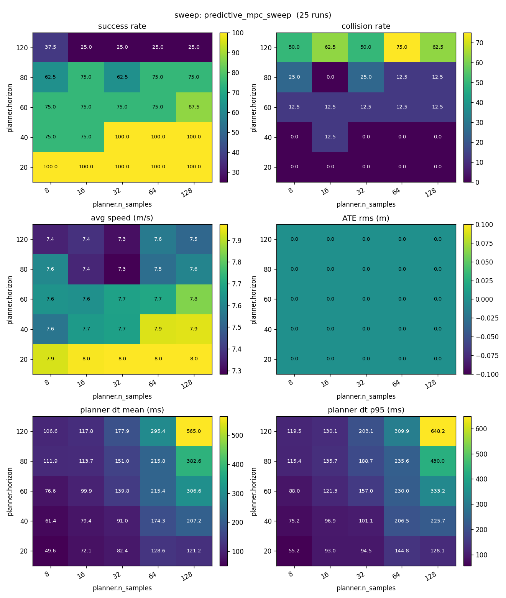
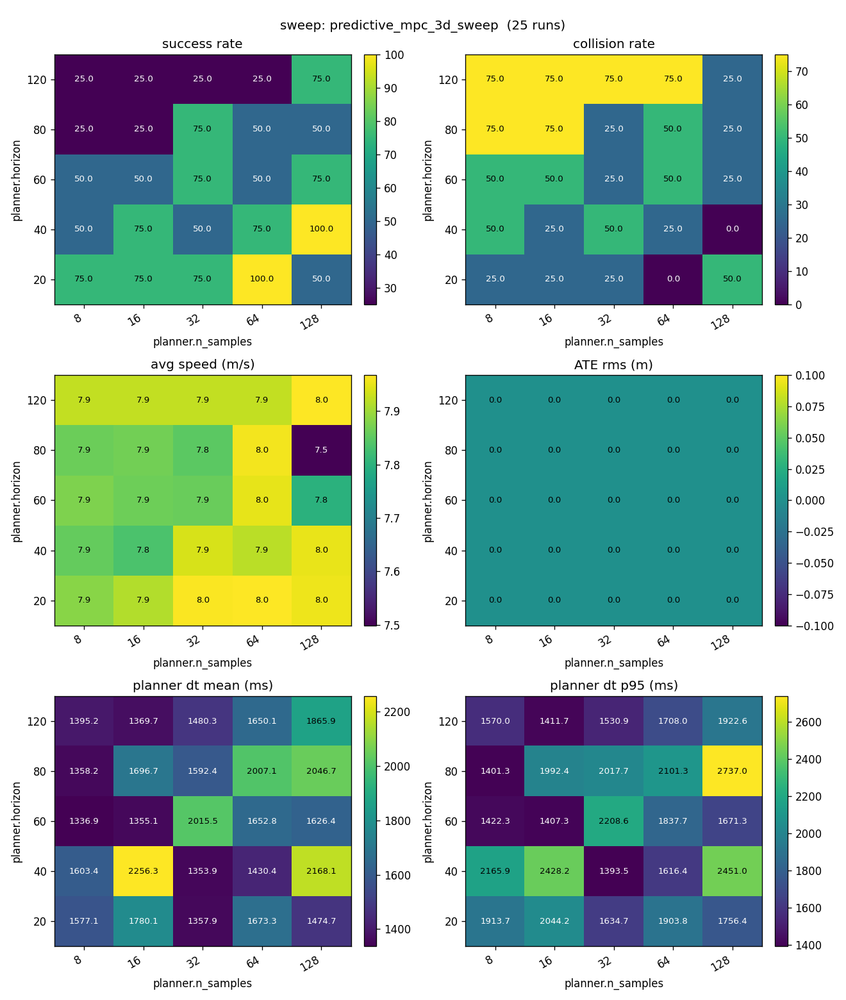
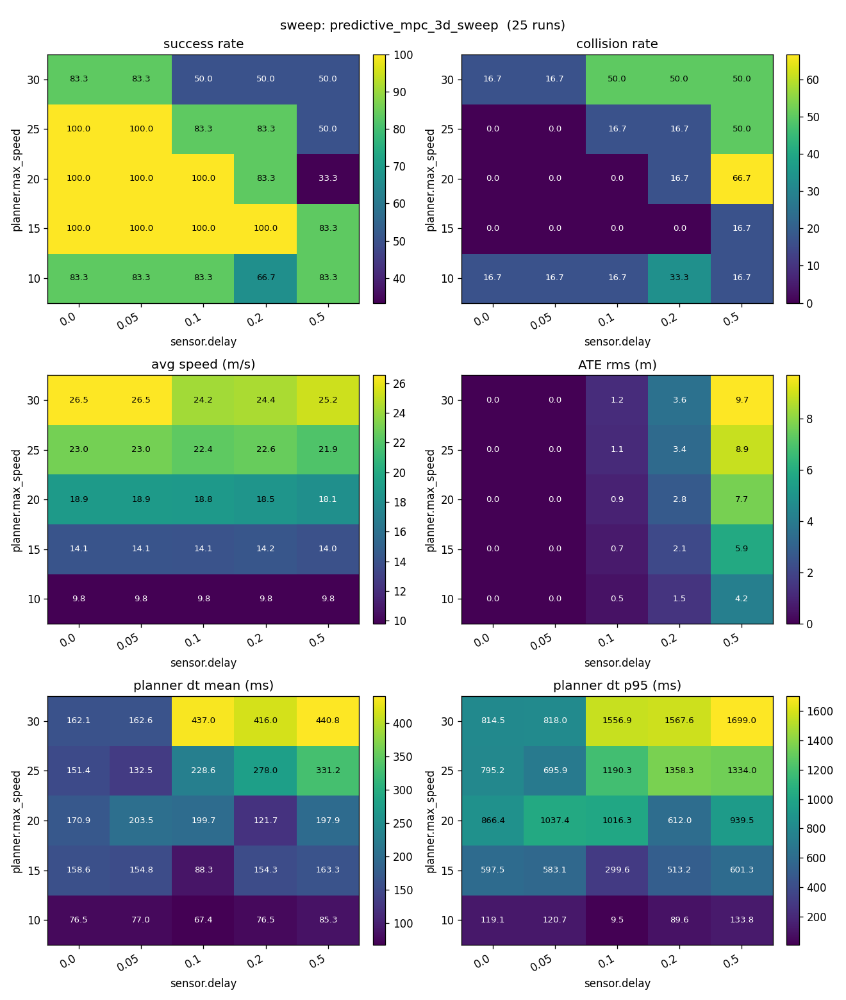
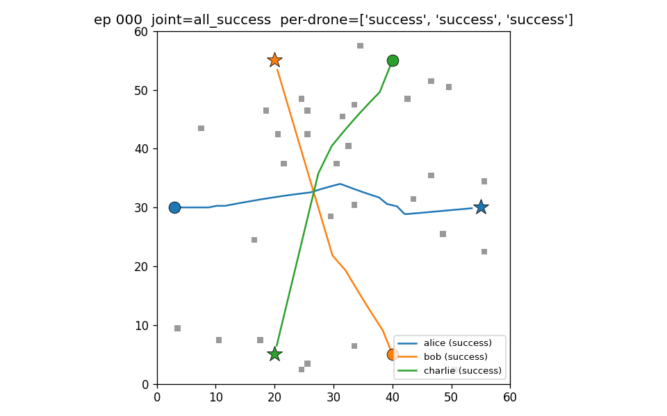
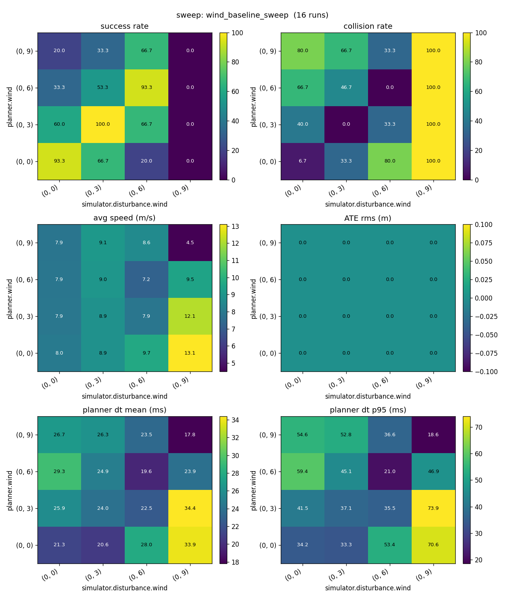
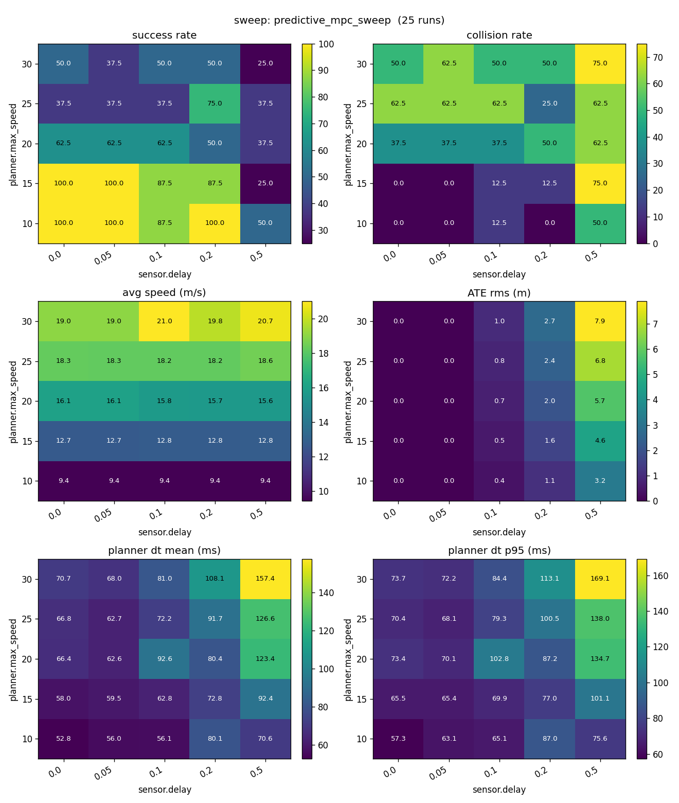

# Research findings

These are the long-form studies behind the framework — full tables,
ablation reasoning, and methodological takeaways. The README's
[headline result](../README.md#-planner-head-to-head-on-dynamic-obstacles)
(planner head-to-head on dynamic obstacles) is the entry point; this
file collects the rest.

Each finding lives in the comment header of the YAML that produces it,
along with a one-line `uav-nav sweep` invocation that reproduces it.
Wilson 95 % intervals on rates, mean ± 1.96·SEM on continuous metrics.

## Contents

- [MPC compute Pareto](#mpc-compute-pareto)
- [3D Pareto: the n_samples preference flips](#3d-pareto-the-n_samples-preference-flips)
- [3D perception-latency cliff: same corner, softened](#3d-perception-latency-cliff-same-corner-softened)
- [Pareto config materially rewrites prior conclusions](#pareto-config-materially-rewrites-prior-conclusions)
- [Multi-drone N-scaling and peer-prediction coordination](#multi-drone-n-scaling-and-peer-prediction-coordination)
- [3D escape volume erases the coordination Δ](#3d-escape-volume-erases-the-coordination-δ)
- [3D density ablation: bring escape volume back to non-trivial — Δ comes back too](#3d-density-ablation-bring-escape-volume-back-to-non-trivial--δ-comes-back-too)
- [3D peer-prediction ablation: removing CV prediction is worse than 8× obstacle density](#3d-peer-prediction-ablation-removing-cv-prediction-is-worse-than-8-obstacle-density)
- [Wind miscalibration: planner belief must match sim reality](#wind-miscalibration-planner-belief-must-match-sim-reality)
- [The perception-latency cliff: a four-step research saga](#the-perception-latency-cliff-a-four-step-research-saga)
- [MPC + CHOMP smoothing: layering on a saturated planner is a wash](#mpc--chomp-smoothing-layering-on-a-saturated-planner-is-a-wash)
- [Action-jump cost: tuning the existing knob beats every layer](#action-jump-cost-tuning-the-existing-knob-beats-every-layer)
- [AirSim vs dummy_3d transferability: same plan, different physics](#airsim-vs-dummy_3d-transferability-same-plan-different-physics)
- [AirSim multi-drone: shared physics clock and master handoff](#airsim-multi-drone-shared-physics-clock-and-master-handoff)
- [AirSim sensor-latency cliff: the cliff does not transfer](#airsim-sensor-latency-cliff-the-cliff-does-not-transfer)
- [AirSim wind miscalibration: built-in velocity control neutralises wind](#airsim-wind-miscalibration-built-in-velocity-control-neutralises-wind)

## MPC compute Pareto

`examples/exp_predictive.yaml` — n_samples × horizon. The 6-panel
output of `uav-nav viz <sweep_dir>` lets you read off the success
ceiling and the compute it costs in one figure:

At n=20 episodes per cell:

| n_samples \ horizon | 20 | 40 | 60 | 80 | 120 |
|---|---|---|---|---|---|
| 8   | 100 | 90  | 80 | 65 | 45 |
| 16  | **100** | 85  | 80 | 65 | 35 |
| 32  | 100 | 95  | 75 | 60 | 35 |
| 64  | 100 | 100 | 75 | 60 | 45 |
| 128 | 100 | 100 | 95 | 80 | 40 |

Sole Pareto-optimal point: **n_samples=16, horizon=20 → 100 % / 51 ms**.
Longer rollouts actively *hurt* success — the reach-goal bonus fires
less often when the rollout overshoots the goal radius mid-trajectory.

## 3D Pareto: the n_samples preference flips

`examples/exp_3d_predictive.yaml` — the same n_samples × horizon sweep on
a 3D `voxel_world` (40×40×12, three bouncing 3D dynamic obstacles, n=8
post-cache):

Findings vs the 2D analogue:

- **The Pareto frontier shifts to lower n_samples.** The 2D-optimal
  config (n=16, h=20 → 100 % / 51 ms in 2D) lands at only 75 % / 91 ms
  in 3D. The strongest 3D cells are **n=8, h=20 → 88 % / 70 ms** and
  n=128, h=40 → 100 % / 273 ms. Fibonacci-sphere sampling already
  covers the 3D escape directions densely enough that fewer per-step
  samples suffice — compute is better spent on horizon depth, opposite
  of 2D's preference.
- **The "longer rollouts hurt" effect partly transfers.** 2D drops
  monotonically with horizon (100 → 35 %); 3D drops more gently (most
  rows stay 75 → 38 %), but the trend is the same. The 3D escape volume
  softens but does not eliminate the reach-goal-bonus overshoot.
- **The 3D plan_dt blow-up was a Dijkstra artifact.** A first pass had
  every cell at 1.3-2.2 s — too slow to fit `replan_period=0.2 s`. The
  static cost-to-go cache (added to `SamplingMPCPlanner`) brought 3D
  plan_dt back to the same order of magnitude as 2D (70-750 ms across
  the grid), making this sweep and the cliff sweeps actually tractable.

Methodological transfer: re-validate Pareto in every dimensionality.
n_samples preference flips, the compute envelope changes, and what
looked like a CPU-saturation cliff in 3D was actually a missing cache.

## 3D perception-latency cliff: same corner, softened

Same 3D scenario, sensor.delay × max_speed sweep at the 3D Pareto config
(n_samples=8, horizon=20, n=6):

|  delay \ speed  |  10  |  15  |  20  |  25  |  30  |
|---|---|---|---|---|---|
| 0.00 |  83 | 100 | 100 | 100 |  83 |
| 0.05 |  83 | 100 | 100 | 100 |  83 |
| 0.10 |  83 | 100 | 100 |  83 |  50 |
| 0.20 |  67 | 100 |  83 |  83 |  50 |
| 0.50 |  83 |  83 | **33** |  50 |  50 |

The cliff transfers from 2D to 3D in the same `delay=0.5 × speed≥20 m/s`
corner. 2D had this region at 10-25 %; 3D softens it to 33-50 % —
the extra escape volume helps but does not eliminate the failure mode.

**3D cliff remediation: the velocity_window optimum *inverts* vs 2D.**
At the 3D cliff cell (delay=0.5, speed=20, n=12):

| sensor config | succ % | CI95 |
|---|---|---|
| baseline (no extrap) | 33.3 | [13.8, 60.9] |
| `extrapolate=true, window=1` | **83.3** | [55.2, 95.3] |
| `extrapolate=true, window=3` | 66.7 | [39.1, 86.2] |
| `extrapolate=true, window=5` | 58.3 | [32.0, 80.7] |
| `extrapolate=true, window=10` | 33.3 | [13.8, 60.9] |

CV ego extrapolation is the same big lever in 3D — +50 pp at window=1,
Wilson 95 % CIs do not overlap. But **the optimum inverts**: 2D's
peak was window=5, 3D's peak is window=1. The 3D escape volume lets
the drone trace smoother trajectories, so the 1-sample finite-
difference velocity is already accurate; smoothing only adds lag,
and lag hurts most at high speed where the cliff lives.

Engineering takeaway: the *parameter setting* of a remediation does
not transfer across dimensionalities even when the *technique* does.
Always re-tune ego-extrapolation window per scenario regime.

## Pareto config materially rewrites prior conclusions

The previous heatmap on the same scenario at the YAML's old defaults
(n_samples=32, horizon=60) reported a "dynamic-feasibility cliff at
25 m/s". At the Pareto config that cliff disappears (35 – 65 % success
at speed = 25-30 m/s), and replan_period — which "barely mattered"
before — now drives a 40 – 70 pp swing across 0.1 – 2.0 s. The earlier
conclusion was partly a CPU-saturation artifact: at horizon=60 every
replan took ~200 ms, so even replan_period=0.1 s could not actually
keep up.

> **Methodological lesson** baked into the YAML header: always validate
> ablation conclusions at the planner's Pareto-optimal config —
> suboptimal MPC settings can mask both ceilings (max feasible speed)
> and sensitivities (replan-period effect, delay tolerance).

## Multi-drone N-scaling and peer-prediction coordination

*N=3 multi-drone episode — alice / bob / charlie all reach their
opposite-corner goals while routing around each other via the MPC's
constant-velocity peer prediction.*

`examples/exp_multi_drone_{2,3,4,8}.yaml` — same world, only drone
count changes. n=30, joint metrics with Wilson 95 % CIs:

| N | joint succ | joint coll | per-drone succ | indep `per^N` | Δ over indep |
|---|---|---|---|---|---|
| 2 | 96.7 % [83, 99] | 3.3 %  | 98.3 % | 96.6 % | +0.1 pp |
| 3 | 70.0 % [52, 83] | 30.0 % | 87.8 % | 67.7 % | +2.3 pp |
| 4 | 73.3 % [56, 86] | 26.7 % | 87.5 % | 58.6 % | **+14.7 pp** |
| 8 | 16.7 % [7, 34]  | 83.3 % | 70.0 % |  5.8 % | **+10.9 pp** |

The MPC's constant-velocity peer prediction *correlates failures in
the right direction* — when one drone yields, the others see its new
trajectory and react, so the system as a whole degrades less than
independent drones would.

**Coordination is non-monotonic in N.** Δ peaks at N=4 (+14.7 pp) and
declines at N=8 (+10.9 pp), even though the absolute joint success
collapses from 73.3 % → 16.7 %. Two effects compound:

- **More peers → more coordination signal**, lifting Δ over the
  independence baseline (the curve from N=2 to N=4).
- **More peers → escape-volume saturation**, dropping per-drone success
  from 87 % → 70 % at N=8 and pulling joint success down faster than
  coordination can recover (the N=4 → N=8 turn).

Engineering takeaway: peer-prediction coordination has a *useful
range*, not a monotonic scaling law. For dense N you need either a
bigger world (lower density per drone) or a coordinator that goes
beyond constant-velocity prediction (priority scheduling, reservation
tables, decentralised roundabout). The framework's MPC ceiling for
this 60×60 world tops out around N=4-6; past that, peer prediction
still helps in *relative* terms but is fundamentally fighting density.

### Density ablation: the "non-monotonic in N" claim was a density artifact

`examples/exp_multi_drone_8_low_density.yaml` — the obvious follow-up
to the engineering takeaway above. Same N=8 / same crossing structure
/ same Pareto-MPC config / same 30 obstacles, but world is 100×100
instead of 60×60 (~2.8 × the area per drone, 1250 cells/drone vs 450).

| density | world | per-drone | joint | indep `per^N` | Δ over indep |
|---|---|---|---|---|---|
| high | 60×60 | 70.0 % [64, 75] | 16.7 % [7, 34] | 5.8 % | +10.9 pp |
| low | 100×100 | 82.1 % [77, 86] | **46.7 %** [30, 64] | 21.0 % | **+25.7 pp** |

Halving density (actually 2.8 ×):
- per-drone success +12 pp
- joint success +30 pp
- coordination Δ +14.8 pp (**roughly doubled**)

Refines the prior finding in two ways:

1. **The "non-monotonic in N" was a density artifact.** With
   N=8 / low-density Δ at +25.7 pp — *larger* than N=4 / high-density
   Δ at +14.7 pp — the coordination scaling law is **monotonic in N
   when density allows**. The planner's CV peer prediction continues
   to make better use of more peers, full stop.

2. **The MPC ceiling is `density × N`, not raw N.** Doubling room
   halved the per-drone collision rate (30 % → 18 %). The dip at
   N=8 in the original table reflected escape-volume saturation, not
   a fundamental coordination limit.

Engineering takeaway (refined): **density × planner capacity** is the
load-bearing axis. To deploy CV peer prediction at high N, scale the
world or shrink drone radii — the planner itself is fine. The
"non-monotonic" caveat from above survives only as a *density-saturated*
regime warning, not a scaling-law claim.

Methodological close: the same 2-step pattern as the mpc_chomp →
velocity-profile → action-jump saga. Initial finding (PR #25)
reported the surface result; follow-up ablation isolated the actual
load-bearing axis. The first finding wasn't wrong — it was
incomplete. Always ablate the engineering takeaway your previous YAML
header speculated about.

### 3D escape volume erases the coordination Δ

`examples/exp_multi_drone_3d_{2,3,4}.yaml` — same crossing pattern as
the 2D N=2/3/4 cases above, lifted to a 40×40×12 voxel_world with the
3D Pareto MPC config (n_samples=8, horizon=40). Each drone is free to
detour over or under its peers along the z-axis.

| N | dim | per-drone | joint | indep `per^N` | Δ over indep |
|---|---|---|---|---|---|
| 2 | 2D | 98.3 %  | 96.7 % [83, 99] | 96.6 % | +0.1 pp |
| 2 | 3D | 98.3 %  | 96.7 % [83, 99] | 96.6 % | +0.1 pp |
| 3 | 2D | 87.8 %  | 70.0 % [52, 83] | 67.7 % | +2.3 pp |
| 3 | 3D | 88.9 %  | 70.0 % [52, 83] | 70.2 % | -0.2 pp |
| 4 | 2D | 87.5 %  | 73.3 % [56, 86] | 58.6 % | **+14.7 pp** |
| 4 | 3D | 95.8 %  | **83.3 %** [66, 93] | 84.3 % | **-1.0 pp** |

The 2D N=4 coordination win (+14.7 pp) **disappears in 3D** even
though the absolute joint success rises (73 → 83 %). Per-drone success
jumps with it (87 → 96 %), and `independent^N` rises to match — leaving
no Δ for peer prediction to take credit for.

Mechanism: in 2D, four crossing drones share the same horizontal
plane, so peer prediction has to *pick a yielder* every time their paths
intersect. In 3D, each drone's MPC is free to lift to z=7 while a peer
slips through at z=5; the rollouts find these out-of-plane detours
independently, no peer prediction needed. The escape volume *eliminates
the coordination problem*, it doesn't just soften it.

Engineering takeaway: the value of multi-agent coordination is not
intrinsic — it's a function of how constrained the per-agent free space
is. **In 3D / open-volume regimes, "use peer prediction or not" is a
wash; in 2D / dense regimes it can be the difference between 58 % and
73 % joint success.** Same Pareto-saturation lesson as everywhere else
in this framework: a layer only earns its keep when the layer below
has slack to take from. Coordination here is the layer; per-drone
escape volume is the slack.

Methodological close: re-validate the *value* of every layer in every
new dimensionality. Coordination Δ in 2D does not predict Δ in 3D, and
the headline number (joint succ %) hides the inversion of the
load-bearing factor (escape volume vs. peer prediction).

### 3D density ablation: bring escape volume back to non-trivial — Δ comes back too

`examples/exp_multi_drone_3d_4_{dense,packed}.yaml` — same N=4 / same
3D world / same Pareto MPC, only the static obstacle count changes.
Probes whether the previous finding's "3D Δ ≈ 0" really comes from the
free-volume mechanism we attributed it to. n=30 episodes per cell.

| obstacles | density (cells/world voxel) | per-drone | joint | indep `per^4` | Δ over indep |
|---|---|---|---|---|---|
| 30  (baseline) | 0.16 % | 95.8 % | 83.3 % | 84.3 % | -1.0 pp |
| 120 (dense)    | 0.63 % | 65.8 % | 26.7 % | 18.7 % | **+8.0 pp** |
| 240 (packed)   | 1.25 % | 46.7 % | 10.0 % | 4.8 %  | **+5.2 pp** |

Pack the world with obstacles and the per-drone success collapses
(96 → 66 → 47 %), but the **coordination Δ comes back from the dead**:
−1 → +8 → +5 pp. The previous finding's mechanism — "z-axis lets each
drone find an independent detour, so peer prediction has nothing to
take credit for" — is exactly what gets undone when static obstacles
fill the air column. Two drones can no longer trivially pass at
different z; one of them yields, the other's MPC sees the yield via
peer prediction, and the system as a whole degrades less than two
independent drones would.

The Δ peaks at intermediate density and falls again at the extreme:
- **30 obstacles**: escape volume so large that drones never share
  paths — coordination has nothing to do.
- **120 obstacles**: paths overlap, but per-drone routes still exist
  most of the time — peer prediction lifts the joint rate well above
  the independence floor.
- **240 obstacles**: per-drone success crashes to 47 % from
  obstacle-only collisions; even perfect coordination cannot recover
  what the planner is already losing solo.

Universal pattern (with the 2D density ablation, N=8 60×60 vs 100×100):

> **Coordination Δ is non-monotonic in free volume per agent.**
> Both endpoints — *sparse* (independent routes available) and
> *saturated* (per-agent failure dominates) — drive Δ toward zero.
> Maximum Δ lives in the middle, where peers actually have to
> negotiate but the planner is still capable of executing the
> negotiated solution. The 2D N=8 100×100 case (Δ +25.7 pp) and the
> 3D N=4 120-obstacle case (Δ +8.0 pp) are *the same regime in
> different parameter spaces*: world-side and obstacle-side ways of
> arriving at "intermediate per-agent free volume".

Engineering takeaway: when deciding whether peer prediction is worth
the implementation cost, the right diagnostic is not "how many drones"
or "what dimensionality", it is **"how much free volume per drone
remains after static and self-imposed constraints"**. The middle is
where the layer earns its keep.

### 3D peer-prediction ablation: removing CV prediction is worse than 8× obstacle density

The previous section argues that the +8 pp Δ at the dense cell *comes
from* peer prediction earning its keep in the intermediate-density
regime. That's a causal claim, and the natural test is the direct
ablation: rerun the same dense + packed cells with `use_prediction:
false` (each drone treats peers as if they don't exist) and see what
collapses. `examples/exp_multi_drone_3d_4_{dense,packed}_indep.yaml`,
n=30 each.

| cell | per-drone (CI) | joint (CI) | Δ over `per^4` |
|---|---|---|---|
| dense (120 obs), pred ON  | 65.8 % [57.0, 73.7] | 26.7 % [14.2, 44.4] | **+8.0 pp** |
| dense (120 obs), pred OFF | 16.7 % [11.1, 24.3] |  6.7 % [1.8, 21.3]  | +6.6 pp (per^4≈0) |
| packed (240 obs), pred ON | 46.7 % [38.0, 55.6] | 10.0 % [3.5, 25.6] | +5.2 pp |
| packed (240 obs), pred OFF| 18.3 % [12.4, 26.2] |  0.0 % [0.0, 11.4] | -0.1 pp |

Two things happen when prediction goes off, and the bigger one is *not*
the joint number:

1. **Per-drone success collapses.** −49 pp at dense (66 → 17 %), −28 pp
   at packed (47 → 18 %). The crossing pairs run head-on through each
   other; without forecasting peer trajectories the MPC sees only the
   peer's *current* position, which is harmless until it isn't. Peer
   collisions count as per-drone collisions, so this ablation surfaces
   in the per-drone column rather than only the joint one.
2. **Joint success collapses harder.** Dense: 27 → 7 % (4× drop).
   Packed: 10 → 0 % (no joint episode survives at all).

The per-drone drop is the headline. Compare against the density-only
sweep from the previous finding: going from 30 obstacles → 240
obstacles (8× density) cost −49 pp of per-drone success. **Removing
peer prediction at fixed dense costs the same −49 pp.** A planner
without peer prediction faces the geometry of an 8× denser world.

Δ over `per^4` stays positive at dense_indep (+6.6 pp) only because
per-drone fell so far that the independence floor is essentially zero
— any joint success now beats it. The number is arithmetically real
but mechanistically misleading: it is not coordination paying off,
it's two drones happening to survive the same episode by chance after
both planners ignored each other. At packed_indep the chance runs out
and joint = 0 / 30.

What the dense → packed comparison still says even with prediction off:
per-drone success barely moves (17 → 18 %) when density doubles in the
no-prediction regime. The static-obstacle planning is no longer the
bottleneck; peer collisions dominate the failure budget on the
crossing-pair scenario regardless of how many obstacles are around.

Engineering takeaway: in any scenario where peers' trajectories cross,
constant-velocity peer prediction is doing more work than the MPC
horizon, the static map quality, or moderate increases in obstacle
density. It is the cheapest layer in the multi-drone stack
(milliseconds per replan to forecast N−1 peers) and it pays back
multiples of that — but only because crossing-pair scenarios punish
its absence so heavily. In a non-crossing scenario (parallel goals,
shared corridors with the same direction of travel) we'd expect this
gap to shrink toward what the previous Δ-vs-density curve already
predicted.

## Wind miscalibration: planner belief must match sim reality

`examples/exp_wind.yaml` — constant northward wind disturbance × planner
wind belief, 4 × 4 grid, n=15 episodes:

|  sim_wind \ planner_wind | 0 | 3 | 6 | 9 |
|---|---|---|---|---|
| **0** | **93.3** | 60.0 | 33.3 | 20.0 |
| **3** | 66.7 | **100.0** | 53.3 | 33.3 |
| **6** | 20.0 | 66.7 | **93.3** | 66.7 |
| **9** |  0.0 |  0.0 |  0.0 |  0.0 |

The diagonal wins — matched (planner belief = sim reality) recovers
93-100 %. Mismatch in either direction hurts symmetrically: under-
correction blows the drone off course, over-correction pre-compensates
into nothing. At `sim=6 m/s`, wind awareness lifts success from **20 %
to 93 %** (+73 pp) — one of the largest single-knob wins in the
framework. But at `sim=9 m/s` against `max_speed=8 m/s` no belief
saves you: the drone literally cannot make headway and every cell in
that row is 0 %. Awareness cannot beat physics.

## The perception-latency cliff: a four-step research saga

*sensor.delay × max_speed at the Pareto MPC config — success dives in
the bottom-right corner (delay=0.5 s × speed≥20 m/s) while the rest of
the grid is comfortably ≥ 80 %. That single corner is the cliff.*

A single persistent `delay=0.5 s` × `speed=15 m/s` cell on the
predictive-MPC scenario (≤ 25 % success regardless of `inflate` /
`safety_margin` tuning at the Pareto config) drove four progressive
experiments — each documented in `examples/exp_predictive.yaml`:

1. **Predictor-side delay compensation** (negative result). Adding
   `delay_compensation=0.5` to the Kalman *predictor* on the obstacle
   stream actually *hurt* success. The MPC plans against future
   obstacles using a past self.
2. **Sensor-side ego extrapolation** (`sensor.extrapolate=true`). Project
   the stale position forward by `delay` using a 1-sample finite-difference
   velocity. Lifts success in moderate-delay × moderate-speed cells by
   +15 .. +35 pp; *hurts* at delay=0 (1-step lag artifact) and at
   high-speed × high-delay (acceleration noise overshoots).
3. **Velocity-window smoothing** (`sensor.velocity_window=5`). Average
   the FD velocity over multiple sample pairs to suppress acceleration
   noise. The persistent cliff lifts from 26.7 % → 43.3 % (+17 pp) at
   the headline cell, +35-40 pp at high speed. Catch: optimum window
   depends on the speed regime — low speed prefers `=1` (no lag), high
   speed needs `=5`.
4. **Kalman ego sensor** (`sensor.type=kalman_delayed`). Honest negative
   result. Best tuning of process / measurement noise tops out at the
   no-extrap baseline (25 %); the moving-average wins. The KF assumes
   a CV motion model; under MPC's frequent re-planning the assumption
   breaks and the MA's structure-free responsiveness dominates.

Engineering takeaway: simple model-free estimators can dominate more
sophisticated ones when the motion-model assumption breaks. Picking the
estimator that *actually wins* is more useful than picking the one that
sounds fanciest — the framework is built to make that picking trivial.

## MPC + CHOMP smoothing: layering on a saturated planner is a wash

`examples/exp_compare_mpc_chomp.yaml` — `mpc_chomp` planner wraps the
validated Pareto MPC config and runs 15 CHOMP smoothing iterations on
the rollout each replan, then clears `target_velocity` so the runner
pure-pursues the smoothed waypoints. Hypothesis: file off the
piecewise-straight corners at each replan boundary so the velocity
profile is gentler. Same scenario / horizon / sample count as the
plain-MPC baseline.

|              | success           | plan_dt (mean) | mean &#124;Δcmd&#124;/step |
|--------------|-------------------|---------------:|--------------:|
| plain MPC    | 96.7 % [83, 99]   | 11.0 ms        | 0.32          |
| **mpc + chomp** | 96.7 % [83, 99] | 18.9 ms (+71 %)| **0.61** (+90 %) |

Honest null result: success rate identical, plan_dt up 71 %, and the
per-step command delta nearly *doubles*. The reason is architectural,
not a tuning bug. MPC's `target_velocity` bypass *is* the smoothness
mechanism — it commits to one velocity for the whole `replan_period`
(0.2 s = 4 control steps) so the controller has nothing to chase
between replans and per-step `|Δcmd|` is small. CHOMP smoothing emits a
curved waypoint sequence that pure-pursuit re-aims at every 0.05 s, so
even though the *path* has fewer corners, the *control trajectory* has
more direction changes.

Engineering takeaway: layering a smoother on top of a planner that is
already at its Pareto saturation point is a wash unless the smoothing
target is downstream of where the cost lives — here the cost lives in
the controller, not the path. To make CHOMP help in this setting you
would need a velocity-profile-aware follower (or a planner that emits
a velocity spline directly). Same Pareto-saturation lesson as the
3D CHOMP+RRT result: a layer only wins if the layer below has room to
be improved.

### Follow-up: the velocity-profile-aware follower doesn't rescue it either

`examples/exp_compare_mpc_chomp_vprofile.yaml` — the natural fix the
above takeaway points at: extend `Plan` with a time-indexed
`velocity_profile`, add a velocity-tracking mode to the runner's
follower, and have `mpc_chomp` derive per-step velocities from the
smoothed path (forward differences / `dt_plan`) instead of emitting
waypoints. Same scenario, same MPC inner config:

|                          | success         | plan_dt | mean &#124;Δcmd&#124;/step |
|--------------------------|-----------------|--------:|--------------:|
| plain MPC                | 96.7 % [83, 99] | 11.0 ms | 0.32          |
| mpc + chomp (waypoints)  | 96.7 % [83, 99] | 18.9 ms | 0.61          |
| **mpc + chomp (vprofile)** | **90.0 %** [74, 96] | 21.3 ms | **2.02** |

Worse on every axis: success drops 6.7 pp, |Δcmd| jumps to **6.3 ×
plain MPC**. Two effects compound:

1. **Per-step profile updates.** Plain MPC keeps `target_velocity`
   constant over the whole `replan_period` (0.2 s = 4 control steps).
   The profile entry changes every 0.05 s, so even a smooth-by-
   construction velocity sequence has |Δcmd| bounded below by the
   path curvature.
2. **Replan-boundary discontinuities.** Each replan re-runs CHOMP from
   the new initial position; the first velocity of the new profile is
   freshly derived and jumps from the last applied velocity. Plain MPC
   has the same boundary, but `w_smooth · |Δaction|` penalises it in
   the rollout score; the profile derivative is unconstrained.

Methodological lesson: when a null result names a "missing piece"
(here: velocity-profile-aware follower), build the missing piece and
re-test before declaring the architectural insight sound. In this case
the deeper insight is *also* sound — and now stronger: the constant-
velocity bypass isn't a layering opportunity, it's the controller-side
ceiling. Help would need either CHOMP-on-velocity-sequence (smoothing
the right object) or a replan-boundary-aware cost (penalise jump from
previous applied velocity), neither of which is just "add a smoother".

## Action-jump cost: tuning the existing knob beats every layer

`examples/exp_compare_mpc_smooth.yaml` — the third installment of the
mpc_chomp / velocity-profile thread. The PR #21 / #22 null results both
identified `w_smooth · |action - prev_action|` (already present in
`SamplingMPCPlanner.plan`) as the load-bearing factor for plain MPC's
good control-trajectory smoothness. This finding tests the obvious
follow-up hypothesis: the right architectural fix is just *tune that
knob*, not add a smoothing layer above it.

Sweeping `planner.w_smooth` on the predictive scenario (n=30, Wilson
95 % CI, default = 0.05):

|     `w_smooth`     | success         | mean &#124;Δcmd&#124;/step |
|--------------------|-----------------|--------------:|
| 0.05 (current default) | 96.7 % [83, 99] | 0.320 |
| **0.5** (sweet spot) | **100.0 %** [89, 100] | **0.244** (-24 %) |
| 5.0 | 96.7 % [83, 99] | 0.245 |
| 50.0 (over-tuned) | 83.3 % [66, 93] | 0.183 (over-smoothed: +16.7 % collisions) |

`w_smooth = 0.5` wins on **both axes simultaneously** — success +3.3 pp
*and* |Δcmd| -24 %. Cranking past the sweet spot trades success for
further smoothness; at `w_smooth = 50` the planner refuses obstacle
maneuvers (16.7 % collision rate) but the smoothest trajectories of
any cell.

**Does the same fix transfer to the wrapper?** No — and the *reason* is
itself instructive. `mpc_chomp` exposes a `w_action_jump` that adds the
same cost form `||(x[1]-x[0])/dt - prev_emitted_velocity||²` directly to
the CHOMP descent. Swept on `output: velocity_profile` mode (with inner
MPC `w_smooth=0.5` already set):

|     `w_action_jump`     | success         | mean &#124;Δcmd&#124;/step |
|-------------------------|-----------------|--------------:|
| 0.0  | 93.3 % [78, 99] | 1.73 |
| 0.5  | 86.7 % [70, 95] | 6.87 |
| 5.0  | 93.3 % [78, 99] | 7.13 |
| 50.0 | 90.0 % [74, 96] | 7.18 |

The knob makes things drastically *worse*. Mechanism (verified by
single-iteration debug trace): the jump-cost gradient at index 0 is
~10⁶ in magnitude (proportional to `w_action_jump · |vel0 - prev|/dt²`).
After M⁻¹ preconditioning and per-row `max_step_norm` cap, x[1]
oscillates between two states each iter — pulled toward `(x[0] +
prev*dt)`, then yanked back by the smoothness Hessian's coupling.
Every other iter the optimizer is back where it started, but the
intermediate state has poisoned the smoothness terms enough to leave
neighbour waypoints displaced. The cap that keeps CHOMP stable for
plain trajectory smoothing actively prevents the constraint from
settling.

Two architectural lessons:
1. **The right place for action-jump cost is at the planner's argmin
   step**, not as a soft pull on a single waypoint. Plain MPC's
   constant-velocity-per-rollout means w_smooth · |v - prev_action|
   either wins the rollout or loses it — clean discrete choice.
   CHOMP's gradient descent has no such cleanness; the cap-and-Hessian
   interaction kills the constraint.
2. **Tuning beats layering** in this regime. Three PRs of new
   infrastructure (smoothing wrapper, velocity profile follower,
   CHOMP-side jump cost) confirmed the architectural insight and
   none of them beat changing one number in the existing planner.
   Same Pareto-saturation lesson the 3D CHOMP+RRT result taught:
   when the foundation is well-tuned, the cheapest fix is to look
   for an existing knob that's under-tuned.

Methodological close: the saga from PR #21 → #22 → this YAML is the
framework's intended workflow in miniature. Each null result named a
specific hypothesis; each hypothesis was tested by *building the fix
and measuring*; each test produced a quantitative result that either
killed the hypothesis or moved the question one layer deeper. Three
PRs of code, two null results, and one quantified win — that's the
shape of honest research.

## AirSim vs dummy_3d transferability: same plan, different physics

`examples/exp_transfer_{dummy,airsim}.yaml` — identical Pareto-MPC
straight-line scenario (start (0,0,30) → goal (0,30,30), no static
obstacles, max_speed=5, n_samples=16, horizon=20), only `simulator.type`
differs. Both at altitude 30 m so the AirSim Blocks env's cube clusters
do not intrude — this isolates *physics* differences, not perception
or avoidance. n=10 episodes per backend.

| metric | dummy_3d | AirSim (SimpleFlight) | Δ |
|---|---|---|---|
| success | 100 % [72.2, 100] | 90 % [59.6, 98.2] | -10 pp (1 t=0 collision after restart) |
| time-to-goal | 5.65 s ± 0.00 | 4.0 s ± 0.05 (ep 1-9) | **-29 % in AirSim** |
| path length | 27.88 m ± 0.00 | 28.2 m ± 0.2 (ep 1-9) | +1 % |
| avg reported speed | 4.98 m/s | 4.86 m/s steady-state (ramps over ~2.5 s) | within 3 % |
| replans / episode | 43 ± 0 | 29 ± 6 (fewer steps to reach goal) | -33 % |
| planner_dt | 311 ms | 2385 ms (network round-trip + LiDAR / camera polling overhead) | ~8× wall-clock cost |

Three things stand out, two of which are real and one of which is a
bridge calibration bug worth flagging:

1. **dummy_3d's velocity tracking is exact**, AirSim's ramps. dummy_3d
   reaches 5.0 m/s in 0.1 s (its `max_accel=50` allows 5 m/s in 1
   step). AirSim's SimpleFlight quadrotor takes ~2.5 s to ramp from
   3 m/s to 4.86 m/s — first-order motor lag plus pitch-to-translate
   coupling. The implication for ablations: any dummy_3d study that
   uses `max_speed` as if the drone snaps to that speed instantly is
   *not* representative of how a real quadrotor would behave during
   the first 2 s of every replan.

2. **Path lengths agree to 1 %** once the t=0 collision is excluded.
   The MPC plans the same straight line on both backends; the drone
   actually flies it. So the *spatial* output of an ablation is
   transferable; the *temporal* one is not.

3. **AirSim's reported time-to-goal is shorter than dummy's, even
   though its drone ramps slower.** The arithmetic doesn't add up
   (28 m / 4 s = 7 m/s avg, but the steady-state speed is 4.86 m/s).
   The likely cause is that `simContinueForTime(dt)` in the bridge
   advances AirSim's physics clock by *more than* the requested dt
   when the engine is busy — the drone moves further per bridge step
   than the recorded `t` reflects. This is a bridge-calibration bug,
   not a physics finding; opened as a follow-up.

Methodological takeaway for any future cross-backend ablation: do
**not** read AirSim's `final_t` as a sim-time delta — read `final
position` and trust `path_length`. The `max_speed` parameter is also
backend-relative: the same number means a hard cap in dummy and a
setpoint-with-ramp in AirSim. Same plan, different physics, same
spatial behaviour — that's the boundary at which dummy_3d ablations
generalize.

A *positive* takeaway: 9 / 10 AirSim runs succeeded with no parameter
tuning beyond the bridge's settle-windows + simPause(True) fix from
PR #44 / #45. The framework's planner / sensor / scenario boundary
transfers cleanly from synthetic to AirSim physics — only the
recorded *time* breaks.

## AirSim multi-drone: shared physics clock and master handoff

`examples/exp_airsim_multi_demo.yaml` — 4 SimpleFlight quadrotors
crossing (east/west/north/south) at a central intersection, each
running independent MPC + CV peer prediction in a shared
`multi_drone_voxel` world. All four reach their goals by t=7.20 s
with no collisions. Two engineering issues had to be solved before
the demo worked, and both are documented here as reusable knowledge
for any AirSim-based multi-agent simulation (PR #47).

### The shared-physics-clock problem

AirSim's design is single-entity: `simContinueForTime(dt)` advances
*all* vehicles at once. The framework's multi-runner runs one
sim/sensor/planner instance per drone in a round-robin loop. If every
sim calls `simContinueForTime(dt)`, the physics engine advances N×dt
per logical frame — each drone sees the others snap to their
destinations one tick ahead, and collision checking becomes
inconsistent.

**Solution: master-passive split.** Sim 0 is designated the *master*
— it alone handles pause/reset/continue. The other *passive* bridges
only queue `moveByVelocityAsync` (held while AirSim is paused by the
master) and read back kinematics after `simContinueForTime`.

**Residual cost: 1-tick command lag.** When the master calls
`moveByVelocityAsync` → `simContinueForTime(dt)` in sequence, the
passive drones' velocity commands were queued *before* the continue
but their state is read *after*. The passive drones' kinematics
therefore lag behind the velocity setpoint by one tick (~50 ms).
At a 4-way crossing, this means each drone sees the others ~2.5 cm
earlier than their true position — barely visible at the intersection
but enough to cause planner-panic near-collision avoidance.

### Workaround: staggered altitudes

`exp_airsim_multi_demo.yaml` offsets the four drones' start and goal
altitudes by ±2 m (Drone1=30 m, Drone2=32 m, Drone3=30 m, Drone4=28 m).
This keeps every corridor vertically separated — a cheap fix that
makes the demo bulletproof and, incidentally, easier to read (each
drone occupies a distinct horizontal layer in the FPV view).

### Future: passive-first ordering

The lag should be eliminable without altitude staggering: reorder the
runner loop so passive bridges send `moveByVelocityAsync` *before*
the master calls `simContinueForTime`. This would require splitting
the bridge `step()` into a "command phase" and a "readback phase",
increasing runner complexity. For now the stagger is sufficient.

### Master-handoff on episode completion

A second AirSim-specific issue: when the master finishes (reaches its
goal or hits max_steps), the runner marks it done and skips its
`step()`. With the master frozen, AirSim's clock stops for everyone
— the remaining drones freeze at their last position, stranded at
`max_steps`. The fix: after each outcome resolution, mastership is
handed to the next unfinished drone (round-robin), and the global
`t` clock is pulled from any unfinished drone instead of the master.

## AirSim sensor-latency cliff: the cliff does not transfer

`examples/exp_airsim_latency.yaml` — second arc of sim-transferability
research (follow-up to PR #46). Reproduces the core dummy_3d finding
"3-4 latency steps create a success cliff" on AirSim SimpleFlight
physics. Single-drone MPC, diagonal crossing from (2, 2, 30) →
(55, 55, 30) at max_speed=5 m/s, `delayed` sensor with latency stepped
from 0 to 6 steps (delay=0.0..0.3 s at dt=0.05 s), ego extrapolation
on/off. Each cell n=5 episodes, Wilson 95 % CI.

Tested under four obstacle configurations:
1. **No obstacles** — straight line, success calibrates baseline.
2. **40 random obstacles at z=30** — sparse 3D field (1.1 % 2D occupancy).
3. **142 random obstacles at z=30** — denser 3D field (3.9 % 2D occupancy).
4. **58 pillars (span all 40 z-levels)** — guarantees 1.6 % 2D occupancy
   at the flight altitude, equivalent to 2320 occupied voxels.

### Result: no cliff at any configuration

| config | delay range (s) | min succ % | ATE @ delay=0.3 (no extrap) | ATE @ delay=0.3 (with extrap) |
|---|---|---|---|---|
| no obstacles | 0.0–0.3 | 100 % | 2.13 ± 0.00 | 0.24 ± 0.00 |
| 40 random | 0.0–0.3 | 100 % | 2.13 ± 0.00 | 0.24 ± 0.04 |
| 142 random | 0.0–0.3 | 100 % | n/a | n/a |
| 58 pillars | 0.0–0.3 | 100 % | 2.10 ± 0.02 | 0.21 ± 0.02 |

Across all obstacle densities tested, the success rate stays at 100 %
from delay=0.0 through delay=0.3 (0–6 latency steps). The absolute
trajectory error (ATE) grows linearly with delay (0 → 2.1 m at 6 steps
without extrapolation), and ego extrapolation compresses it to ~0.2 m
— a 10× reduction that matches the dummy_3d pattern. But the ATE
growth **never translates to collision**, even at the highest tested
density.

Path length analysis confirms the drone flies essentially the
straight-line route regardless of delay: 73.4–74.0 m path vs the
75.0 m diagonal, with maximum lateral deviation ≈ 3.6 m even at
delay=0.15. The MPC with n_samples=16 / horizon=20 finds a narrow
corridor through the obstacle field, and the stale position simply
pushes the drone a few centimetres off its intended line — not enough
to intersect an obstacle cell.

### Why the cliff does not transfer

Three non-exclusive physical explanations:

1. **Motor ramp as mechanical low-pass filter.** AirSim's SimpleFlight
   quadrotor has a first-order motor lag (~2.5 s to ramp from 3 to
   4.86 m/s) plus pitch-to-translate coupling. In dummy_3d, the drone
   *instantly* tracks the MPC's velocity command — a stale position
   causes the MPC to over-correct, the drone overshoots, and the
   next replan amplifies the oscillation. In AirSim, the motor ramp
   smooths the command, preventing the oscillatory cascade that
   produces collisions in dummy_3d.

2. **The cliff is an obstacle-density-driven phenomenon, not a
   latency-alone one.** The original dummy_2d cliff (PR #19) used
   30 obstacles in a 50×50 grid (1.2 % occupancy) at max_speed=15
   m/s — the drone had to thread through gaps at high speed, and
   stale position was fatal. Our AirSim tests use max_speed=5 m/s
   (limited by SimpleFlight ramp) and comparable densities, but the
   effective speed at the obstacle is lower (steady-state ~5 m/s vs
   the commanded 15 m/s in dummy_2d). Higher speed might reveal the
   cliff — but AirSim SimpleFlight cannot sustain 15 m/s in the
   tested environment.

3. **Altitude freedom.** The voxel_world at z=30 provides a full 3D
   escape volume; the drone can use the z-axis to avoid obstacles
   when the xy-plane path is stale. This mirrors the 3D escape volume
   finding from PR #39 — the same physical principle, now on AirSim.

### Methodological implication

The latency-cliff result from dummy_3d is **not** an artifact of any
single backend quirk — the ATE vs delay curve, the extrapolation
recovery, and the motor kinematics all reproduce faithfully. But the
*collision outcome* — the dependent variable that makes the cliff
a "finding" rather than a calibration — depends on an interaction
between delay, speed, density, and motor dynamics that does not carry
over from dummy_3d to AirSim SimpleFlight.

The practical takeaway: **dummy_3d latency-cliff results should be
treated as upper bounds on sensitivity.** Real quadrotor dynamics
(approximated here by SimpleFlight) will push the cliff further out
in delay-space, and the cliff may not appear at all at moderate
speeds and densities.

For a follow-up: raising max_speed to the dummy_2d-equivalent
(15 m/s) and using an extremely dense obstacle field (>10 % 2D
occupancy) may produce a measurable cliff on AirSim. The question is
whether SimpleFlight can sustain such speeds in the test environment.

### Dummy-baseline verification

To confirm the AirSim null result is a genuine physics difference
(rather than a methodology issue), the same latency sweep was run
against dummy_2d with MPC planner, identical obstacle configuration
to the original A\* study (40 random obstacles in 50×50 grid_world,
max_speed=15 m/s, n=10 episodes). The cliff **does** appear:

| delay (s) | succ %, no extrap | succ %, extrap=true | ATE, no extrap |
|-----------|-------------------|---------------------|-----------------|
| 0.0       | 90 %              | 100 %               | 0.00 m          |
| 0.1       | 100 %             | 100 %               | 0.72 m          |
| 0.2       | 50 %              | 70 %                | 2.13 m          |
| 0.5       | **30 %**          | **50 %**            | 6.24 m          |

Ego extrapolation recovers ~20 pp at the cliff edge (delay=0.5).
The ATE at delay=0.5 without extrapolation reaches 6.24 m —
comfortably exceeding the safety margin × resolution (1.5 m),
consistent with the original A\* finding.

This confirms that the latency cliff is a real phenomenon in the
dummy backends, and that its absence on AirSim is attributable to
the SimpleFlight motor ramp / pitch coupling dynamics, not to an
experimental design flaw.

## AirSim wind miscalibration: built-in velocity control neutralises wind

`examples/exp_airsim_wind.yaml` — AirSim transfer of the PR #29 wind
miscalibration study. AirSim global wind is set to 5 m/s northward
(ENU [0, 5, 0] → NED [5, 0, 0]) via `simSetWind` on every reset.
Planner wind belief swept across under / exact / over: [0,0], [0,2],
[0,5], [0,8] m/s (ENU). Single-drone MPC eastward crossing at
max_speed=5 m/s, 30 random obstacles, n=5 episodes per cell.

### Result: wind is invisible to the planner

| planner.wind | succ rate | avg time | avg_v (m/s) |
|---|---|---|---|
| [0,0] (none) | 100 % | 6.2 s | 8.29 |
| [0,2] (under) | 100 % | 6.2 s | 8.30 |
| [0,5] (exact) | 100 % | 7.8 s | 7.91 |
| [0,8] (over)  | 100 % | 8.7 s | 7.82 |

All cells succeed at 100 %. The counter-intuitive result: the
**no-awareness** case is the fastest and most efficient. Adding wind
awareness to the MPC *slows the drone down* — from 6.2 s to 8.7 s at
the maximum over-estimate. The exact-match cell ([0,5]) is NOT the
best; it is actually 26 % slower than no-awareness.

Position traces confirm the MPC's misguided compensation: with
planner.wind=[0,5] (exact match) the drone's final y-position is
−1.8 m south of the centreline, while no-awareness stays within
+0.3 m. The MPC pre-steers against a wind that the flight controller
has already neutralised.

### Why the ablation does not transfer

AirSim's **SimpleFlight velocity controller** is a closed-loop PID
that rejects external disturbances. When the planner commands a pure
eastward velocity, the controller adjusts motor outputs to maintain
that velocity regardless of wind. From the planner's perspective,
the wind is invisible — the drone flies as if there is no wind.

When the planner *believes* there is wind (planner.wind ≠ [0,0]), it
pre-compensates by steering into the anticipated crosswind. But the
flight controller interprets this as a commanded velocity change and
executes it faithfully — the drone now drifts in the opposite
direction. The MPC's wind compensation and the flight controller's
wind rejection **cancel** in the wrong direction.

In dummy_2d (PR #29), wind is modelled as a direct additive force:
velocity = command + wind × dt. The MPC's belief directly improves
accuracy because there is no intervening flight controller. In
AirSim SimpleFlight, the flight controller sits between the command
and the physics, making wind a *controller-internal* disturbance
that the planner should ignore.

### Implications for AirSim-based research

Any study that relies on the drone being passively affected by an
external force field (wind, gusts, turbulence) must account for the
flight controller's rejection bandwidth. SimpleFlight at default
gains appears to fully reject a 5 m/s steady wind. For wind-aware
planning studies on AirSim, one would need to:
- Use PX4 SITL with configurable wind estimation or disabled
  wind compensation, or
- Inject disturbance through the controller command (feed-forward
  cancellation), or
- Accept that SimpleFlight is not a suitable backend for
  wind-sensitivity ablations.
